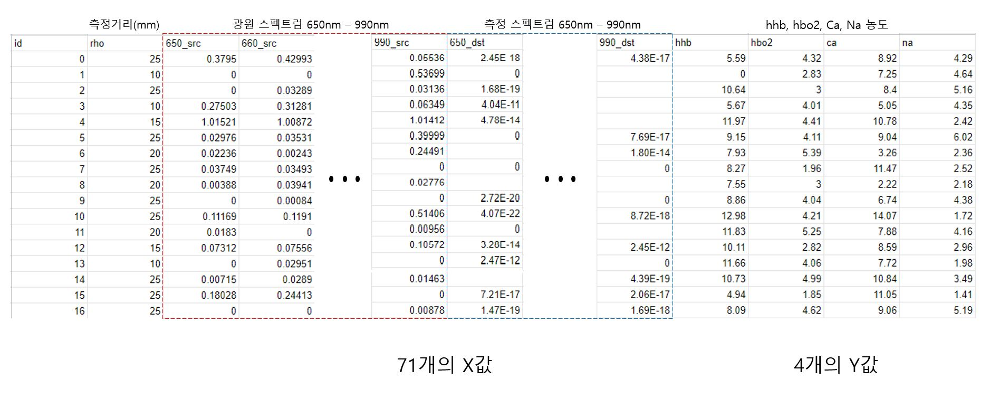

# 생체 광학 데이터 분석 AI 경진대회 ([링크](https://dacon.io/competitions/official/235608/overview/))

>2020.02-2020.06 5개월간 [R과 파이썬을 활용한 빅데이터 분석 전문가 양성과정]을 수강하며
>
>최종 프로젝트로 참여한 경진대회입니다. 
>
>자세한 내용을 위해 프로젝트 과정을 요약 기록한 PPT를 첨부합니다.

## # 프로젝트 목표

- 독립변수 (X) : 광원, 측정 스펙트럼 + 거리 = *71개의 컬럼*

- 종속변수 (Y) : 4가지의 내뇌 성분 농도 = *4개의 컬럼*

- #### 위 10000개의 데이터를 학습 시켜, 독립변수 test set만 주어졌을시 4개의 Y값 예측 모델 구축

## # 분석 환경

- window 10
- python 3.7.7

## # 사용 라이브러리

- `pandas`
- `numpy`
- `matplotlib`
- `sklearn` - preprocessing, model_selection, metrics
- `keras` - models, layers, callbacks
- `tqdm`
- `time`
- `missingno`

## # 활용 데이터

> 데이터 출처 : [데이터 링크](https://dacon.io/competitions/official/235608/data/)

- `train` - 학습에 필요한 독립변수와 그에 따른 종속변수 10000개 데이터
- `test` - 종속변수를 예측할 10000개의 독립변수 데이터

## # 프로젝트 진행 과정

> 모델을 수립하며 고려했던 사항

- #### 데이터 전처리

  - 독립변수에 있는 0과 NaN에 대한 처리

  - 종속변수에 있는 0에 대한 처리

  - 선형 보간, 비선형 보간

    

- #### 변수 선택 및 추가

  - 나머지 70개의 컬럼과 성질이 다른 rho 컬럼 처리

  - 평균값, 최대-최소 새로운 컬럼 추가

  - 컬럼간 자릿수 차이에 대한 log 변환 및 scaling

    

- #### 모델 선택

  - **ML** : `KNN`, `RandomForest`, `LightGBM`

  - **DL** : `ANN`

    

- #### 모델 조정

  - 모델 파라미터
  - node, layer, overfitting
  - GridSearch, RandomForest, 변수를 선택하여 성능 비교를 통해 모델 조정 및 정확도 비교

#### 위 사진과 같이 고려사항에 대해 각각의 모델을 만들고, Score를 비교하여 가장 점수가 높은 모델을 선택하였다.

## # 모델 실행 결과

> 평가 지표는 Mean Absolute Error (MAE)입니다.

## # 프로젝트를 마무리 하며..

> 머신러닝과 딥러닝을 활용한 첫 프로젝트로, 많은 점을 배울 수 있었고 대표적으로 다음과 같다.

- **결측치 처리**

  0, NaN이라는 두 가지 결측치가 종속변수와 독립변수 모두 있었고, 이를 처리하기 위한 가설들을 세우고 성능을 비교하며 대안을 채택했다. 

  - 결측치도 의미있는 데이터라 판단하여 무시하고 학습 
  - 다른 값으로 대체 - 학습 후 예측값, 선형 보간, 비선형 보간
  - 결측치가 없는 데이터만 추출 

  

- **모델 선택**

  분석 목적에 따라 활용할 수 있는 대표적인 분석 모델이 있는데, 이 중 어떤 모델의 성능이 가장 좋은지 모르기 때문에 모두 구현했고 성능을 비교 분석하였다. 위 과정을 수행하며 `KNN`, `RandomForest`, `LightGBM`, `ANN` 모델에 대해 학습할 수 있었다.

  

- **전처리 및 변수 선택**

  - 데이터의 시각화를 통한 데이터 이해

  - 데이터에 대한 Domain Knowledge

  - 유의미한 변수 추가

  - 변수 Scaling

    

  **특히, Data에 대한 Domain Knowledge와 참고문헌 조사가 중요함을 느꼈다.**

  광학 데이터를 분석하는 프로젝트이기에, 광학 관련 참고 문헌을 조사 및 활용하여 변수를 추가하니 성능이 크게 올랐다. (빛-거리의 관계, 특정 파장과 디옥시 헤모글로빈, 옥시헤모글로빈의 상관관계)

  

##### 데이터 전처리 방안, 여러 분석 모델, 변수 추가에 따른 score 비교를 위해 많은 모델을 만들고 학습했다.

##### 위 사후적 비교 과정을 통해 깨달은 점이 차후에 진행 할 분석 프로젝트에 기반이 될거라고 생각한다.